# LaundryKu – Aplikasi Manajemen Laundry Berbasis Flutter

# 📌 Deskripsi Aplikasi

LaundryKu adalah aplikasi manajemen laundry berbasis Flutter yang digunakan untuk membantu proses pengelolaan laundry mulai dari pemesanan, pelacakan status cucian, pembayaran, hingga manajemen order oleh admin.

### Aplikasi memiliki dua peran pengguna:

1. User (Customer): melihat status Laundry, dan melakukan pembayaran bila laundry sudah siap.

2. Admin: menambahkan order, memperbarui status laundry, mengunggah foto laundry, mencatat pembayaran, dan melihat laporan keuangan.

3. Backend aplikasi menggunakan Supabase sebagai database.

# 📖 Alur Sistem LaundryKu

Aplikasi ini dirancang untuk mendigitalisasi proses laundry konvensional menjadi lebih transparan. Berikut adalah skenario penggunaannya:

1. **Registrasi Mandiri:** Pelanggan mengunduh aplikasi dan melakukan registrasi akun secara mandiri dari rumah.
2. **Drop-off di Outlet:** Pelanggan datang ke outlet LaundryKu terdekat untuk menyerahkan pakaian yang akan dicuci.
3. **Pencatatan Admin:** Admin menerima pakaian, lalu mencatat pesanan baru (berat, jenis layanan, dan harga) melalui aplikasi menggunakan akun admin.
4. **Monitoring Real-time:** Pelanggan dapat pulang dan memantau setiap tahapan proses (sedang dicuci/siap diambil) secara langsung melalui smartphone mereka.
5. **Pembayaran Digital:** Setelah laundry siap, pelanggan melakukan pembayaran melalui aplikasi/cash.
6. **Konfirmasi & Selesai:** Admin mengonfirmasi pembayaran yang masuk, mengunggah foto bukti laundry selesai, dan pesanan dianggap tuntas.

# 🖼️ Screenshot Demo Aplikasi

| Login                                         | Register                                         | User Home                                           |
| :-------------------------------------------- | :----------------------------------------------- | :-------------------------------------------------- |
| 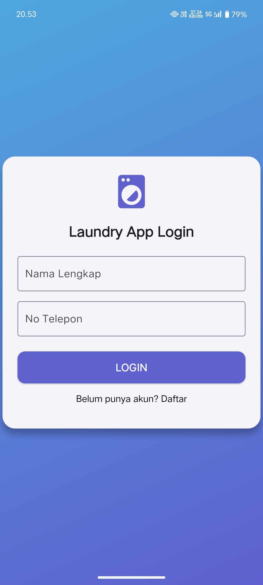 | 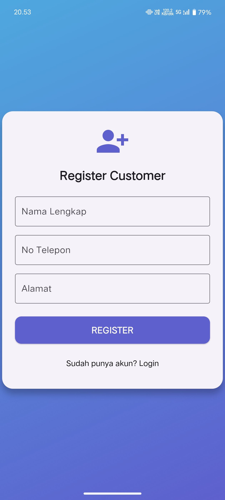 | 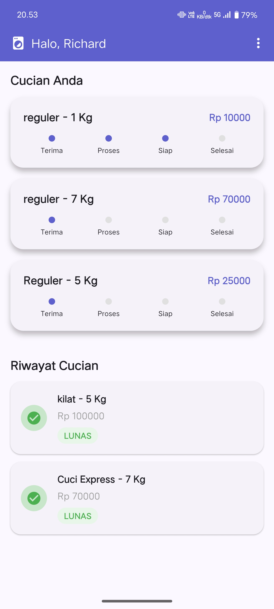 |

| Admin Home                                           | Detail Order User                                          | Detail Order Admin                                          |
| :--------------------------------------------------- | :--------------------------------------------------------- | :---------------------------------------------------------- |
| 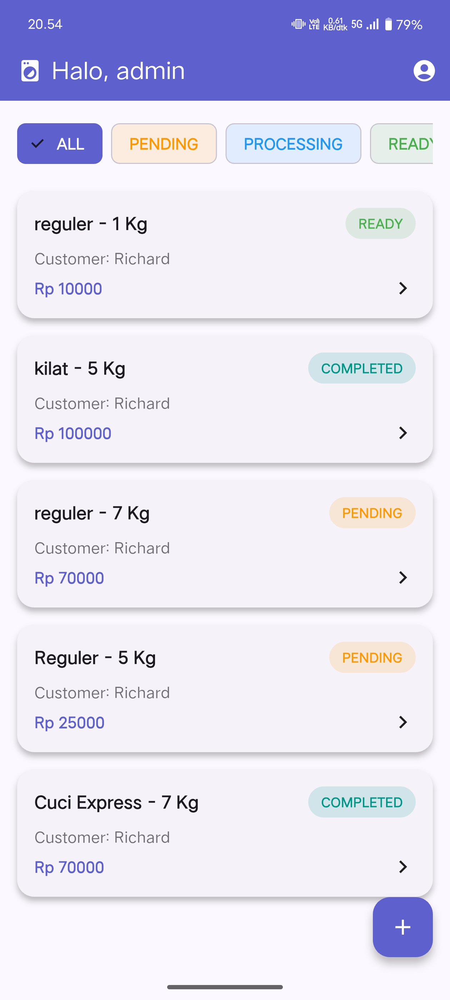 | 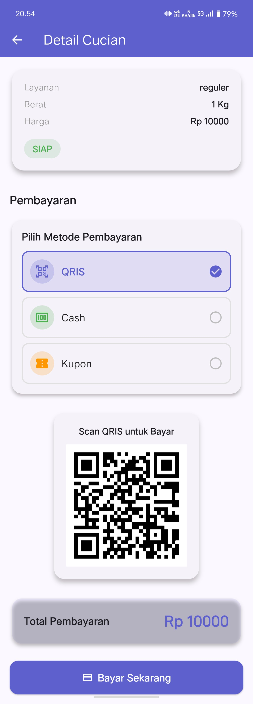 | 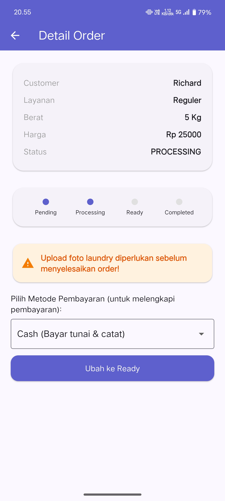 |

| Detail Order Completed                                          | Profile Screen User                                         | Profile Screen Admin                                         |
| :-------------------------------------------------------------- | :---------------------------------------------------------- | :----------------------------------------------------------- |
| 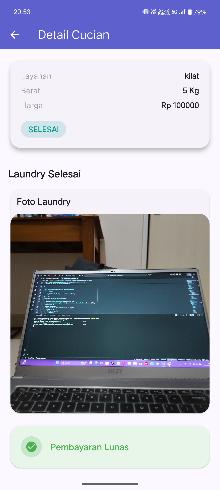 | 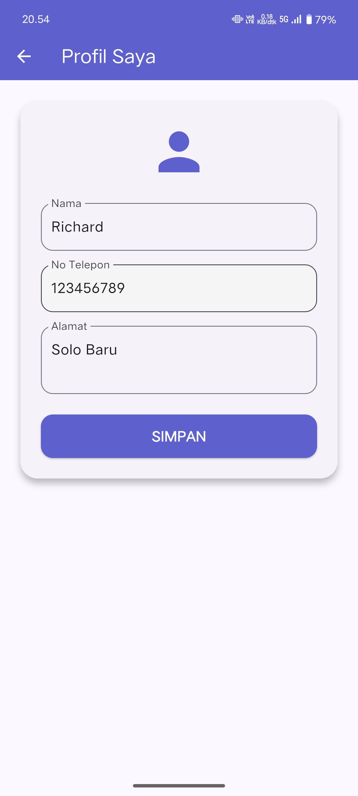 | 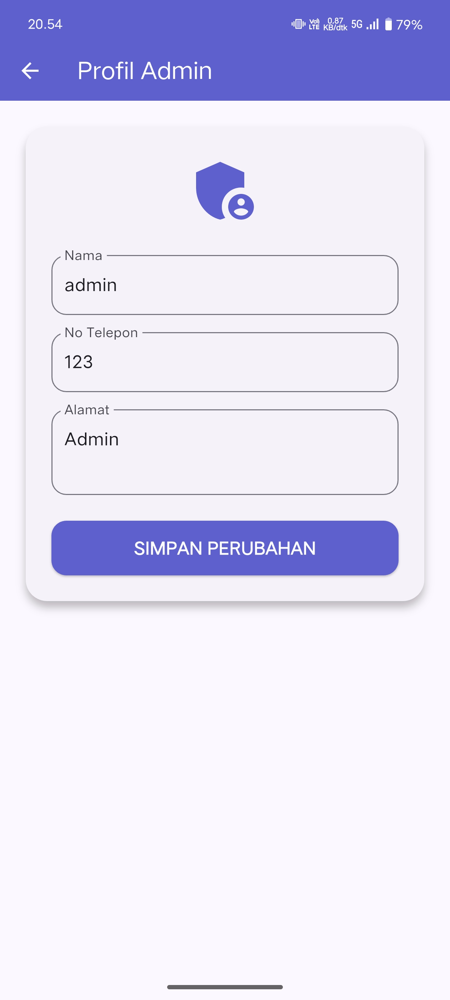 |

| Photo Screen                                              | Report Keuangan                                         |
| :-------------------------------------------------------- | :------------------------------------------------------ |
| 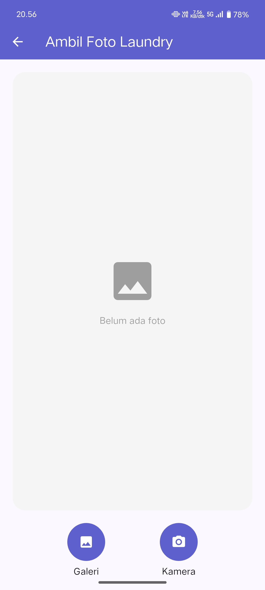 | 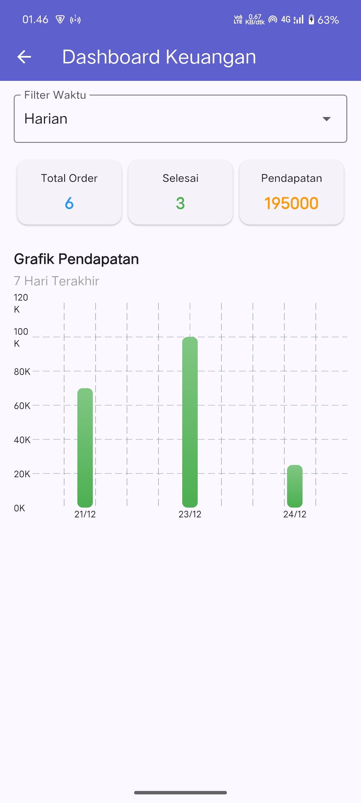 |

### 📁 Screenshot disimpan pada folder:

/Screenshots

# 📱 Link APK / AAB (Testing)

### 🔗 Download APK: https://drive.google.com/drive/folders/1UFBlGDpJuPvZNKofV8r4P0jrhtMbdu_E?usp=sharing

# ▶️ Alur Menjalankan Aplikasi (User Guide)

### 👤 Peran: User (Customer)

1. **Registrasi:** Buka aplikasi, pilih daftar, lalu masukkan Nama, No. Telp, dan Alamat.
2. **Login:** Masuk menggunakan Nama dan No. Telp yang sudah didaftarkan.
3. **Dashboard:** User diarahkan ke `user_screen`. Jika belum ada pesanan, akan muncul pesan "Belum ada cucian".
4. **Cek Status:** Jika ada pesanan, akan muncul kartu status laundry.
5. **Detail Order:** Klik kartu pesanan untuk melihat rincian lengkap laundry.
6. **Pembayaran:** Di halaman detail, User dapat melakukan konfirmasi pembayaran.

### 🔑 Peran: Admin

1. **Login Khusus:** Masuk menggunakan Nama: `admin` dan No. Telp: `123`.
2. **Kelola Pesanan:** Admin memiliki akses untuk menambahkan pesanan baru ke sistem.
3. **Update Status:** Admin dapat mengubah status laundry secara berkala (contoh: dari _Process_ ke _Ready_).
4. **Bukti Foto:** Jika laundry selesai, Admin mengunggah foto sebagai bukti pengerjaan.
5. **Penyelesaian:** Admin melakukan verifikasi pembayaran untuk menutup/menyelesaikan pesanan.

## 🗄️ Database Schema (Supabase)

Aplikasi ini menggunakan **Supabase** sebagai backend. Berikut adalah struktur tabel yang digunakan:

### Tabel: `customers`

| Field     | Type      | Description            |
| :-------- | :-------- | :--------------------- |
| `id`      | uuid (PK) | Primary Key            |
| `name`    | text      | Nama lengkap user      |
| `phone`   | text      | Nomor telepon/WhatsApp |
| `address` | text      | Alamat Customer        |
| `role`    | text      | Role (Admin/Customer)  |

### Tabel: `orders`

| Field          | Type      | Description                                 |
| :------------- | :-------- | :------------------------------------------ |
| `id`           | uuid (PK) | Primary Key                                 |
| `customer_id`  | uuid (FK) | Relasi ke tabel customers                   |
| `weight`       | numeric   | Berat cucian (kg)                           |
| `service_type` | text      | Jenis layanan laundry                       |
| `price`        | numeric   | Total harga                                 |
| `status`       | text      | Status (Pending/Process/Ready/Completed)    |
| `photo_url`    | text      | Link foto bukti laundry di Supabase Storage |
| `date`         | timestamp | Waktu pemesanan                             |

### Tabel: `payments`

| Field            | Type      | Description                |
| :--------------- | :-------- | :------------------------- |
| `id`             | uuid (PK) | Primary Key                |
| `order_id`       | uuid (FK) | Relasi ke tabel orders     |
| `amount`         | numeric   | Total yang dibayarkan      |
| `payment_method` | text      | Method (Tunai/Qris/Kupon)  |
| `created_at`     | timestamp | Waktu pembayaran dilakukan |

# 📂 Struktur Project

### lib/

### ├── models/

### ├── providers/

### ├── screens/

### │ ├── admin/

### │ └── user/

### ├── services/

### └── main.dart

## 🔌 API Documentation (Supabase Services)

Aplikasi berinteraksi dengan Supabase menggunakan service class berikut:

### Customer API (`customer_api.dart`)

| Fungsi                 | Deskripsi                                               |
| :--------------------- | :------------------------------------------------------ |
| `login(name, phone)`   | Validasi user berdasarkan nama dan nomor telepon.       |
| `isPhoneExists(phone)` | Mengecek apakah nomor sudah terdaftar sebelum register. |
| `registerCustomer()`   | Menambahkan data customer baru ke tabel `customers`.    |
| `update(customer)`     | Memperbarui profil customer yang sudah ada.             |

### Order API (`order_api.dart`)

| Fungsi                    | Deskripsi                                                                           |
| :------------------------ | :---------------------------------------------------------------------------------- |
| `getOrdersByCustomer(id)` | Mengambil semua riwayat laundry milik satu customer.                                |
| `Order.status (Logic)`    | Otomatis berubah jadi 'Selesai' jika data pembayaran ditemukan di tabel `payments`. |

### Payment API (`payments_api.dart`)

| Fungsi            | Deskripsi                                                             |
| :---------------- | :-------------------------------------------------------------------- |
| `createPayment()` | Menyimpan data pembayaran ke tabel `payments`.                        |
| `fetchFinance()`  | Mengambil data keuangan untuk dashboard admin (harian/bulanan/tahun). |

# 👤 Author

| Detail          | Informasi                            |
| :-------------- | :----------------------------------- |
| **Nama**        | Richard Christoper Subianto          |
| **NIM**         | A11.2023.14922                       |
| **Mata Kuliah** | Pemrograman Perangkat Bergerak (PPB) |
| **Kelas**       | A11.4702                             |
